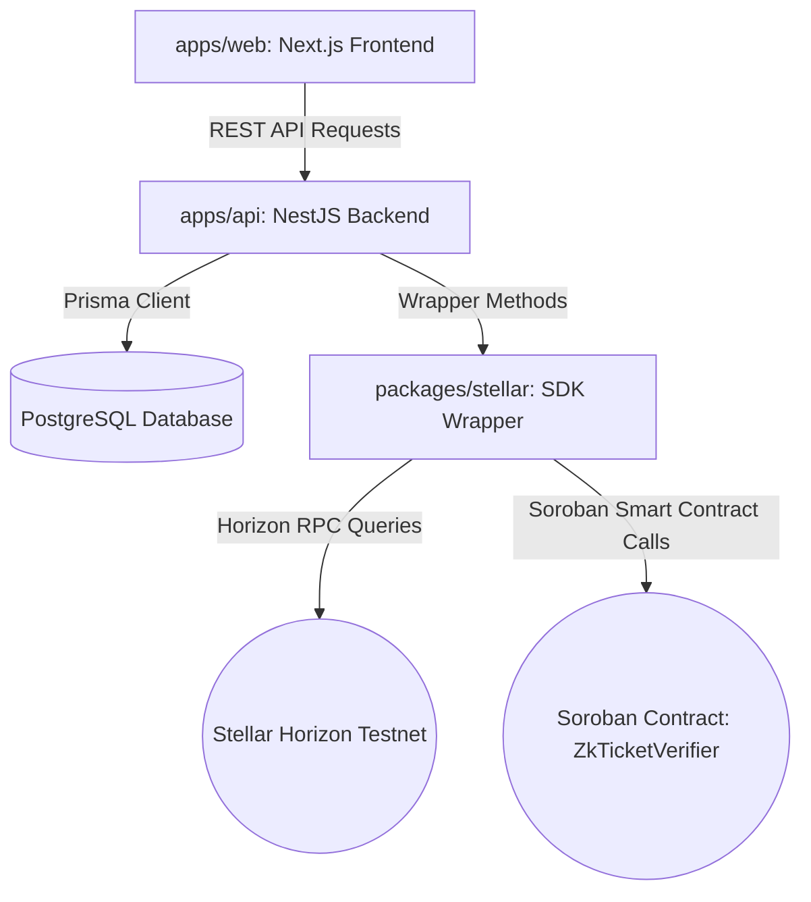
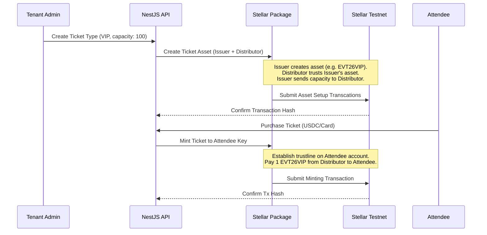
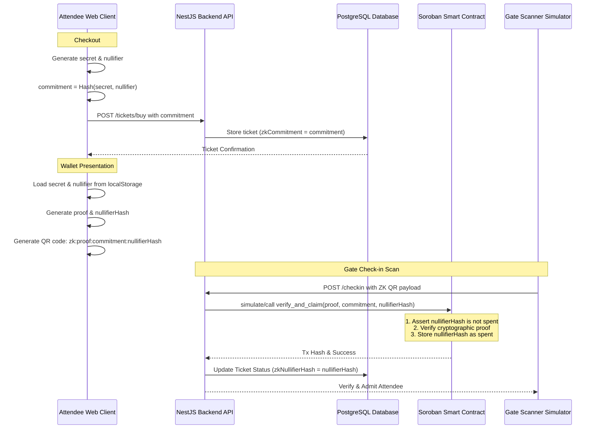

# Architecture Reference Document (ARD) - SmartyEvents

This document defines the system architecture, blockchain integration patterns, database design, API specifications, and frontend requirements for **SmartyEvents**. It serves as a guide for any developer or AI assistant continuing the implementation of this project.

---

## 1. System Overview

SmartyEvents is a multi-tenant, blockchain-powered event ticketing SaaS. It leverages a monorepo setup using **Turborepo** and `npm` workspaces.



### Directory Structure
* **`apps/api`**: NestJS REST API server (runs on port 3001).
* **`apps/web`**: Next.js 16 Web application (runs on port 3000).
* **`packages/database`**: Shared Prisma ORM client and database migration configs.
* **`packages/stellar`**: Shared library containing wrappers around the `stellar-sdk` (v13) to interact with the Stellar network.
* **`packages/soroban`**: Rust smart contract library containing the ZK Ticket Verifier contract deployed to Stellar Testnet.
* **`packages/ui`**: Shared UI library for generic layout components.

---

## 2. Core Architectural Pillars

### A. Multi-Tenant Isolation
* **Database Isolation**: The database schema uses a shared-database, shared-schema model. Every entity that belongs to a specific tenant (e.g. `Event`, `Attendee`, `User`) is linked via a foreign key `tenantId` to the `Tenant` table.
* **API Context Resolution**: Every request to the NestJS API must be resolved to a specific tenant context. This is handled by a middleware/guard checking either:
  1. The requesting host (e.g., custom domain or subdomain `tenant-slug.smartyevents.com`).
  2. A request header `X-Tenant-ID` for API clients.

### B. Stellar Blockchain Ticketing
Ticketing is decentralized. Instead of database-only confirmations, tickets exist as custom assets on the Stellar Testnet.



* **Stellar Accounts per Tenant**: Every `Tenant` is configured with a Stellar Keypair:
  * **Issuer Account**: The issuing address that creates the custom ticket assets. The asset code should follow a unique format based on the event or ticket type (e.g., `EVT[EventYear][TicketClass]`, maximum 12 alphanumeric characters).
  * **Distributor Account**: Holds the inventory of issued ticket assets.
* **Attendee Wallet**: When an attendee purchases a ticket:
  1. If they do not have a public key, the system generates a custodial Stellar Keypair for them and funds it via the Stellar **Friendbot** (since they need native XLM to pay for transaction fees and minimum reserve balances).
  2. The attendee's account creates a `ChangeTrust` operation allowing them to hold the tenant's ticket asset.
  3. The distributor pays `1` ticket asset to the attendee's public key.
* **Ownership Verification**: To prevent fraud or double-spend, checking the gate involves querying the Horizon server for the attendee's public key balance of the specific asset code issued by the tenant's issuer address.

### C. Secure Offline Check-In (HMAC-SHA256)
Since network connectivity can be unreliable at event gates, tickets use a dynamic QR code token.
* **Token Structure**: A signed string containing:
  `ticketId:attendeeId:timestamp:signature`
* **HMAC Signature**: Generated on the backend:
  `HMAC-SHA256(ticketId + ":" + attendeeId + ":" + timestamp, HMAC_SECRET)`
* **Dynamic Lifecycle**: The timestamp is checked on the verification side to prevent replay attacks (e.g., a scanned screenshot of a QR code is only valid for 60 seconds).
* **Double-Spend Protection**: Once a check-in is verified, a record is written to the `CheckIn` table, preventing the same ticket from checking in again.

### D. Zero-Knowledge (ZK) Privacy-Preserving Check-In
To provide absolute attendee privacy while verifying ticket validity, SmartyEvents integrates a hybrid client-database-onchain ZK check-in protocol utilizing a Soroban smart contract.



* **Client-Side Secret Storage**: When an attendee purchases a ticket with ZK Privacy enabled, the Next.js frontend generates a cryptographically secure `secret` and `nullifier` locally, keeping them only in the user's browser `localStorage`.
* **Public Commitment**: The attendee's client registers a hash of these values (`zkCommitment = SHA256(secret || nullifier)`) in the database upon ticket purchase.
* **On-Chain Soroban Smart Contract**: Written in Rust, the `ZkTicketVerifier` smart contract is deployed to Stellar Testnet (Contract ID: `CBATWOA2NBYJUKYF2UULNUWU52XQZBNGDIMK64GIHIEVABI6WYQ45K62`). It provides:
  * `is_spent(nullifier_hash)`: A simulated query to check if the ticket has been checked in before (for gas-free, instant validation).
  * `verify_and_claim(proof, commitment, nullifier_hash)`: A stateful transaction that verifies the ZK proof and registers the nullifier hash in persistent storage to prevent double-spending.
* **Scan Token Format**: The gate scanner parses a ZK-formatted string: `zk:<proof_hex>:<commitment_hex>:<nullifier_hash_hex>`.

---

## 3. Database Schema Blueprint

Managed via [packages/database/prisma/schema.prisma](file:///Users/ettaraphael/Documents/systems/smarty-events/packages/database/prisma/schema.prisma).

```prisma
model Tenant {
  id               String      @id @default(uuid())
  name             String
  slug             String      @unique
  logo             String?
  customDomain     String?     @unique
  stellarPublicKey String?     // Tenant's Stellar wallet public key
  createdAt        DateTime    @default(now())
  updatedAt        DateTime    @updatedAt
  events           Event[]
}

model Event {
  id            String         @id @default(uuid())
  tenantId      String
  tenant        Tenant         @relation(fields: [tenantId], references: [id], onDelete: Cascade)
  title         String
  description   String?
  status        EventStatus    @default(DRAFT)
  startDate     DateTime
  endDate       DateTime
  capacity      Int
  ticketTypes   TicketType[]
}

model TicketType {
  id             String    @id @default(uuid())
  eventId        String
  event          Event     @relation(fields: [eventId], references: [id], onDelete: Cascade)
  name           String    // e.g. VIP, General Admission
  price          Int       // Price in minor units (cents)
  currency       String    // USDC, USD, NGN
  quantity       Int
  sold           Int       @default(0)
  tickets        Ticket[]
}

model Ticket {
  id               String       @id @default(uuid())
  ticketTypeId     String
  ticketType       TicketType   @relation(fields: [ticketTypeId], references: [id], onDelete: Cascade)
  attendeeId       String
  attendee         Attendee     @relation(fields: [attendeeId], references: [id], onDelete: Cascade)
  stellarAssetCode String?      // e.g. EVT26VIP
  stellarTxHash    String?      // Transaction hash of minting/transfer
  status           TicketStatus @default(CREATED)
  zkCommitment     String?      // Client-side generated commitment (SHA-256)
  zkNullifierHash  String?      @unique // Marks spent nullifier to prevent double check-in
  checkIns         CheckIn[]
}
```

---

## 4. API Specification (`apps/api`)

The API exposes the following endpoints (all prefixed with `/api`):

| Method | Endpoint | Description | Payload / Context |
| :--- | :--- | :--- | :--- |
| **POST** | `/tenants` | Create a new tenant (generates Stellar keys) | `{ name, slug, customDomain }` |
| **GET** | `/tenants/:id` | Get tenant configuration & keys | None |
| **POST** | `/events` | Create a new event | `{ title, description, startDate, endDate, capacity }` (Header: `X-Tenant-ID`) |
| **GET** | `/events` | List events under active tenant | Query filter by `tenantId` |
| **POST** | `/events/:id/ticket-types`| Add ticket class & setup Stellar asset | `{ name, price, currency, quantity }` |
| **POST** | `/tickets/buy` | Purchase ticket, generates keys & mints asset | `{ ticketTypeId, attendeeName, attendeeEmail, paymentMethod, zkCommitment? }` |
| **GET** | `/tickets/attendee/:email`| Retrieve all tickets for an attendee | None |
| **GET** | `/tickets/:id/qr-token` | Generate fresh HMAC-SHA256 QR token | None |
| **POST** | `/checkin` | Verify scan token & check-in attendee | `{ qrToken, scannedById, deviceId, zkProof?, zkCommitment?, zkNullifierHash? }` |

---

## 5. UI and Frontend Requirements (`apps/web`)

### Design System & Aesthetics
* **Theme**: Deep dark mode theme. Use background colors such as `#0d0f12`, with accent gradients (`#3b82f6` to `#8b5cf6` - blue to purple).
* **Typography**: Utilize Outfit or Inter fonts.
* **Component Standards**: Avoid using unstyled templates or raw inputs. Wrap controls with glassmorphic gradients (`backdrop-filter: blur(12px)`), rounded corners (`border-radius: 12px`), and hover micro-animations (scale, glow transitions).

### Core Portals
1. **Public Discovery Portal (`/`)**: Displays all active events, with elegant cards, search bars, and Category pills.
2. **Event Details (`/events/[id]`)**: Showcases speaker grid, interactive track schedules (Sessions), and ticket tier layout cards.
3. **Checkout (`/events/[id]/checkout`)**: A multi-step forms modal/page where attendees purchase tickets. Displays a spinner loading animation representing the Stellar blockchain transaction.
4. **Attendee Wallet (`/attendee/tickets`)**: Visual ticket card containing a live-refreshing QR code (regenerates token every 30 seconds to prevent replay attacks) and links to the Stellar transaction on the Horizon block explorer.
5. **Tenant dashboard (`/tenant`)**: Analytics charts tracking ticket sales, active check-in counts, and tenant Stellar keys balance.
6. **Gate Scanner Simulator (`/checkin`)**: Virtual scanner interface for gate staff. Allows inputting the QR token code manually or copying it from the wallet to test the E2E verification loop.

---

## 6. Guide to Implementing the Stellar SDK Wrapping

When writing [packages/stellar/src/index.ts](file:///Users/ettaraphael/Documents/systems/smarty-events/packages/stellar/src/index.ts), implement the following flow:

```typescript
import {
  Asset,
  Keypair,
  TransactionBuilder,
  Networks,
  Server,
  Operation,
} from "stellar-sdk";

const HORIZON_URL = "https://horizon-testnet.stellar.org";
const server = new Server(HORIZON_URL);

// 1. Generate accounts
export function generateKeypair() {
  const pair = Keypair.random();
  return { publicKey: pair.publicKey(), secret: pair.secret() };
}

// Helper to fund account via Friendbot
async function fundAccount(publicKey: string): Promise<void> {
  await fetch(`https://friendbot.stellar.org?addr=${encodeURIComponent(publicKey)}`);
}

// 2. Setup asset limits & trustlines
export async function createTicketAsset(params: {
  issuerSecret: string;
  distributorSecret: string;
  assetCode: string;
  limit: string;
}) {
  const issuerKey = Keypair.fromSecret(params.issuerSecret);
  const distKey = Keypair.fromSecret(params.distributorSecret);
  
  // A. Distributor account loads sequence
  const distAccount = await server.loadAccount(distKey.publicKey());
  
  // B. Build trustline transaction
  const asset = new Asset(params.assetCode, issuerKey.publicKey());
  const transaction = new TransactionBuilder(distAccount, {
    fee: "100",
    networkPassphrase: Networks.TESTNET,
  })
    .addOperation(
      Operation.changeTrust({
        asset: asset,
        limit: params.limit,
      })
    )
    .setTimeout(180)
    .build();
    
  transaction.sign(distKey);
  const trustResult = await server.submitTransaction(transaction);

  // C. Mint inventory from Issuer to Distributor
  const issuerAccount = await server.loadAccount(issuerKey.publicKey());
  const paymentTx = new TransactionBuilder(issuerAccount, {
    fee: "100",
    networkPassphrase: Networks.TESTNET,
  })
    .addOperation(
      Operation.payment({
        destination: distKey.publicKey(),
        asset: asset,
        amount: params.limit,
      })
    )
    .setTimeout(180)
    .build();

  paymentTx.sign(issuerKey);
  const mintResult = await server.submitTransaction(paymentTx);
  
  return { assetCode: params.assetCode, txHash: mintResult.hash };
}

// 3. Trust and mint ticket for attendee
export async function mintTicket(params: {
  distributorSecret: string;
  destinationSecret: string; // The attendee's key to sign ChangeTrust
  destinationPublicKey: string;
  assetCode: string;
  issuerPublicKey: string;
  amount: string;
}) {
  const distKey = Keypair.fromSecret(params.distributorSecret);
  const destKey = Keypair.fromSecret(params.destinationSecret);
  const asset = new Asset(params.assetCode, params.issuerPublicKey);

  // A. Fund account if it's new
  try {
    await server.loadAccount(destKey.publicKey());
  } catch (err) {
    await fundAccount(destKey.publicKey());
  }

  // B. Attendee establishes Trustline
  const destAccount = await server.loadAccount(destKey.publicKey());
  const trustTx = new TransactionBuilder(destAccount, {
    fee: "100",
    networkPassphrase: Networks.TESTNET,
  })
    .addOperation(Operation.changeTrust({ asset: asset }))
    .setTimeout(180)
    .build();
  trustTx.sign(destKey);
  await server.submitTransaction(trustTx);

  // C. Send 1 ticket token from Distributor to Attendee
  const distAccount = await server.loadAccount(distKey.publicKey());
  const payTx = new TransactionBuilder(distAccount, {
    fee: "100",
    networkPassphrase: Networks.TESTNET,
  })
    .addOperation(
      Operation.payment({
        destination: destKey.publicKey(),
        asset: asset,
        amount: params.amount,
      })
    )
    .setTimeout(180)
    .build();
  payTx.sign(distKey);
  const payResult = await server.submitTransaction(payTx);

  return { txHash: payResult.hash };
}

// 4. Verify balance
export async function verifyTicketOwnership(params: {
  publicKey: string;
  assetCode: string;
  issuerPublicKey: string;
}): Promise<boolean> {
  try {
    const account = await server.loadAccount(params.publicKey);
    const balance = account.balances.find((b: any) => {
      return b.asset_code === params.assetCode && b.asset_issuer === params.issuerPublicKey;
    });
    return balance ? parseFloat(balance.balance) >= 1.0 : false;
  } catch (err) {
    return false;
  }
}
```

---

## 7. Execution and Commits Guidelines

To ensure the repository is evaluated as highly active, follow these rules:
1. Make a single git commit for every task block (e.g. "feat: implement packages/stellar library", "feat: create api database context and migrations", etc.).
2. Always verify code builds locally (`npm run build`) before making a commit.
3. Keep clean commit messages with conventional formats (`feat(...)`, `fix(...)`, `chore(...)`).
